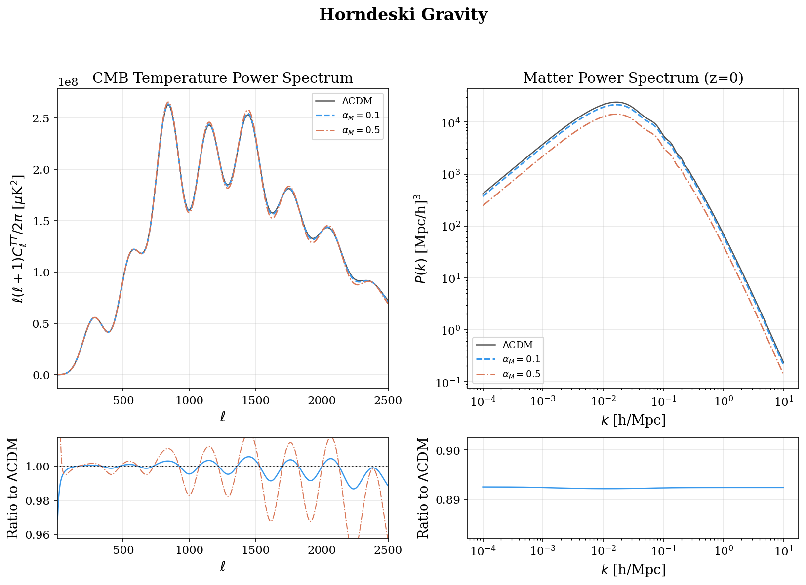
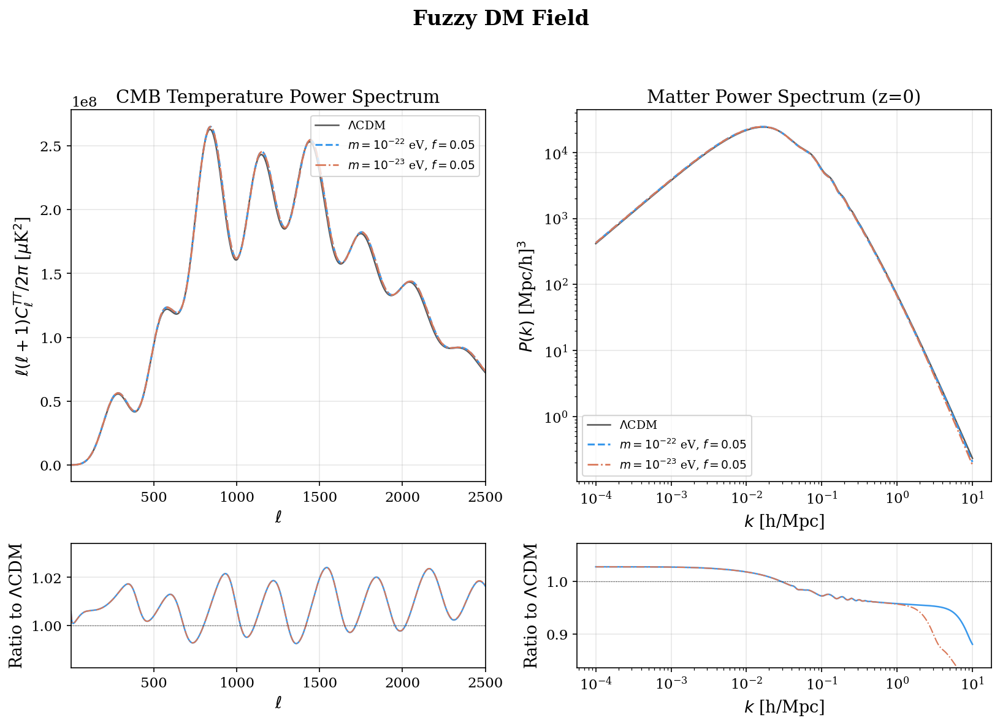

Dark Energy models
==================================

.. autoclass:: camb.dark_energy.DarkEnergyModel
   :members:

.. autoclass:: camb.dark_energy.DarkEnergyEqnOfState
   :show-inheritance:
   :members:

.. autoclass:: camb.dark_energy.DarkEnergyFluid
   :show-inheritance:
   :members:

.. autoclass:: camb.dark_energy.DarkEnergyPPF
   :show-inheritance:
   :members:

.. autoclass:: camb.dark_energy.Quintessence
   :show-inheritance:
   :members:

.. autoclass:: camb.dark_energy.EarlyQuintessence
   :show-inheritance:
   :members:

Interacting Dark Energy
-----------------------

.. autoclass:: camb.dark_energy.InteractingDE
   :show-inheritance:
   :members:

.. image:: figures/interacting_dark_energy.png
   :alt: Interacting DE vs LCDM
   :width: 100%

Horndeski Scalar-Tensor Gravity
-------------------------------

.. autoclass:: camb.dark_energy.HorndeskiDE
   :show-inheritance:
   :members:

Fuzzy DM Field (Klein-Gordon)
-----------------------------

.. autoclass:: camb.dark_energy.FuzzyDMField
   :show-inheritance:
   :members:

.. autoclass:: camb.dark_energy.AxionEffectiveFluid
   :show-inheritance:
   :members:
