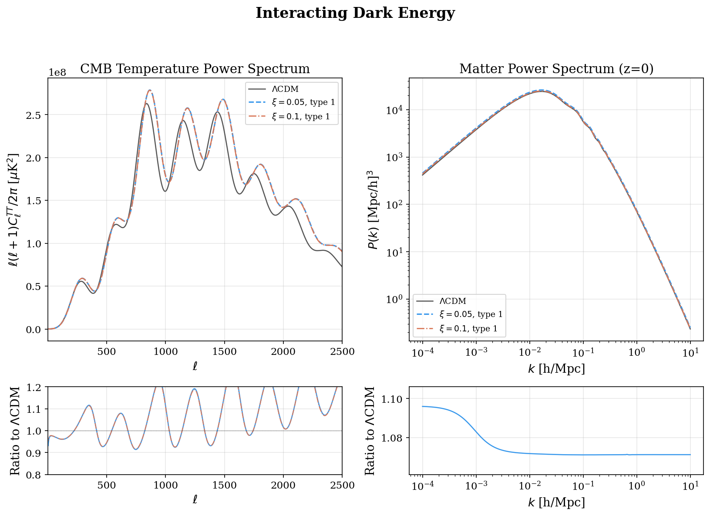

Dark Energy models
==================================

.. autoclass:: camb.dark_energy.DarkEnergyModel
   :members:

.. autoclass:: camb.dark_energy.DarkEnergyEqnOfState
   :show-inheritance:
   :members:

.. autoclass:: camb.dark_energy.DarkEnergyFluid
   :show-inheritance:
   :members:

.. autoclass:: camb.dark_energy.DarkEnergyPPF
   :show-inheritance:
   :members:

.. autoclass:: camb.dark_energy.Quintessence
   :show-inheritance:
   :members:

.. autoclass:: camb.dark_energy.EarlyQuintessence
   :show-inheritance:
   :members:

Validated nonstandard-DE contracts
----------------------------------

The support labels below are deliberately narrower than the mathematical
parameter domains:

* ``TrackerQuintessence`` is supported at the archived Ratra--Peebles and
  exponential benchmark configurations.
* ``CoupledQuintessence`` is supported for the tested potentials and
  :math:`0\leq\beta\leq0.1`.
* ``RunningVacuum`` has exact-background and internal-response validation for
  :math:`|\nu|\leq0.01`; its perturbations have not been compared with an
  independent Boltzmann solver.
* ``KEssence`` is restricted to the near-Lambda range
  :math:`0.5<x_0\leq0.50001`.
* ``Chaplygin`` has analytic-background and limited perturbation benchmarks for
  ``0<As<1``, ``alpha>=0``, and ``alpha*As<=1``. This includes the known Jeans
  pathology and is not a precision validation of the full parameter volume.

.. autoclass:: camb.dark_energy.TrackerQuintessence
   :show-inheritance:
   :members:

.. autoclass:: camb.dark_energy.CoupledQuintessence
   :show-inheritance:
   :members:

.. autoclass:: camb.dark_energy.RunningVacuum
   :show-inheritance:
   :members:

.. autoclass:: camb.dark_energy.KEssence
   :show-inheritance:
   :members:

.. autoclass:: camb.dark_energy.Chaplygin
   :show-inheritance:
   :members:

Interacting Dark Energy
-----------------------

The current science-supported branch is ``interaction_type=1``,
:math:`Q=\xi H\rho_{de}`. Interaction types 2 and 3 are disabled because their
background continuity equations are incomplete. The model has no interacting
PPF prescription, so it accepts either exactly ``w=-1, wa=0`` or an equation of
state satisfying :math:`1+w(a)>10^{-6}` everywhere. The validated sound-speed
configuration is ``cs2_ide=1``. Previously generated type-2 or type-3 outputs
must not be interpreted as physical predictions.

.. autoclass:: camb.dark_energy.InteractingDE
   :show-inheritance:
   :members:

Horndeski Scalar-Tensor Gravity
-------------------------------

Active modified-gravity configurations in ``HorndeskiDE`` are disabled because
the scalar perturbation and stability system is incomplete, the tested
braiding response could not be traced in the matter spectrum, and no
independent Horndeski-solver comparison has passed. A null scalar-spectrum
response from ``alpha_K`` or ``alpha_T`` alone is not treated as diagnostic.
Only exact LambdaCDM is supported: ``w=-1``, ``wa=0``, all alphas zero, and
``M_star_ini=1``. Separately tested model-specific implementations are
available through ``pars.MG``.

.. autoclass:: camb.dark_energy.HorndeskiDE
   :show-inheritance:
   :members:

Fuzzy DM Field (Klein-Gordon)
-----------------------------

Active ``FuzzyDMField`` configurations are disabled. Validation found that the
requested present-day axion abundance was not recovered and that the
background and perturbation KG-to-EFA transitions were inconsistent. The null
configuration is retained for regression tests. For science calculations use
the separately validated effective-fluid/transfer implementation appropriate
to the required approximation, or restore this solver only after an
independent reference comparison.

.. autoclass:: camb.dark_energy.FuzzyDMField
   :show-inheritance:
   :members:

.. autoclass:: camb.dark_energy.AxionEffectiveFluid
   :show-inheritance:
   :members:
