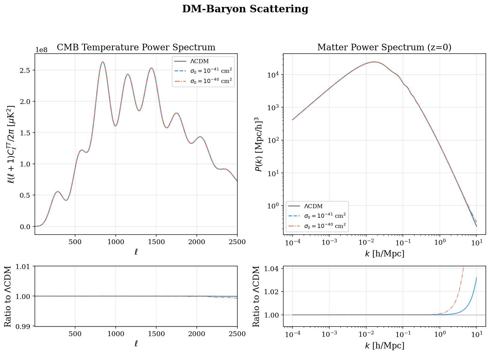
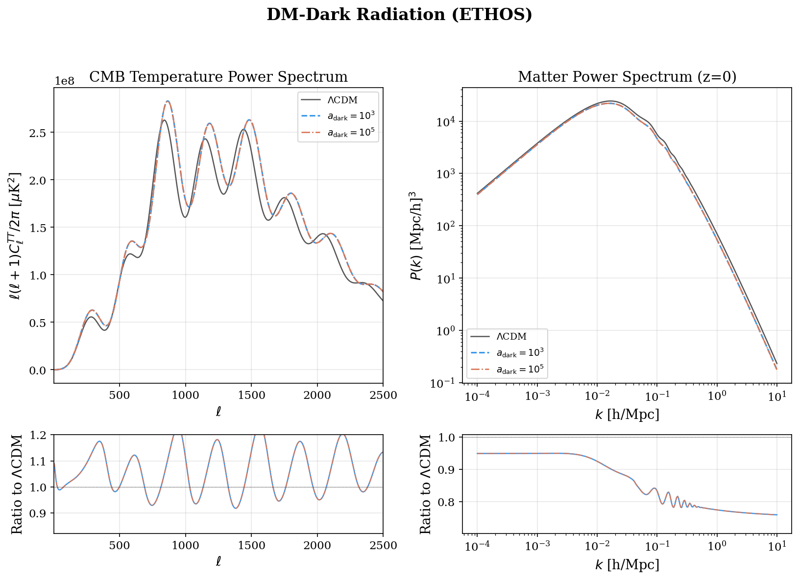
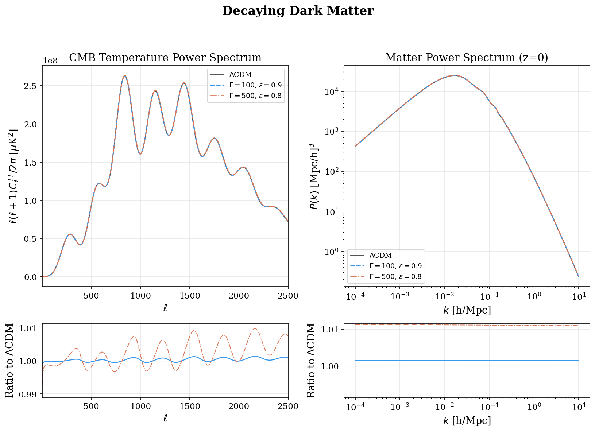
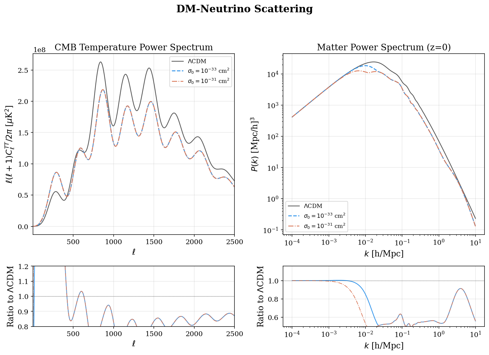
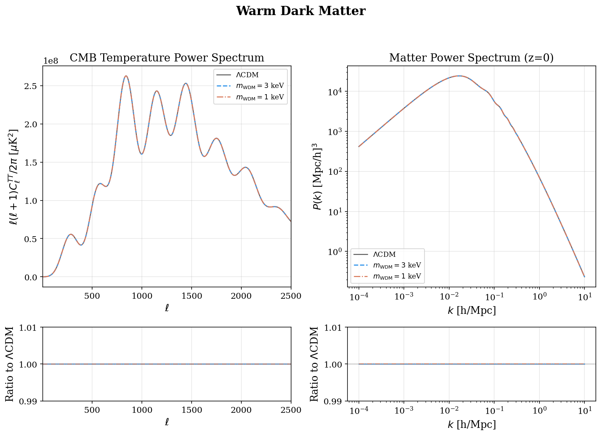
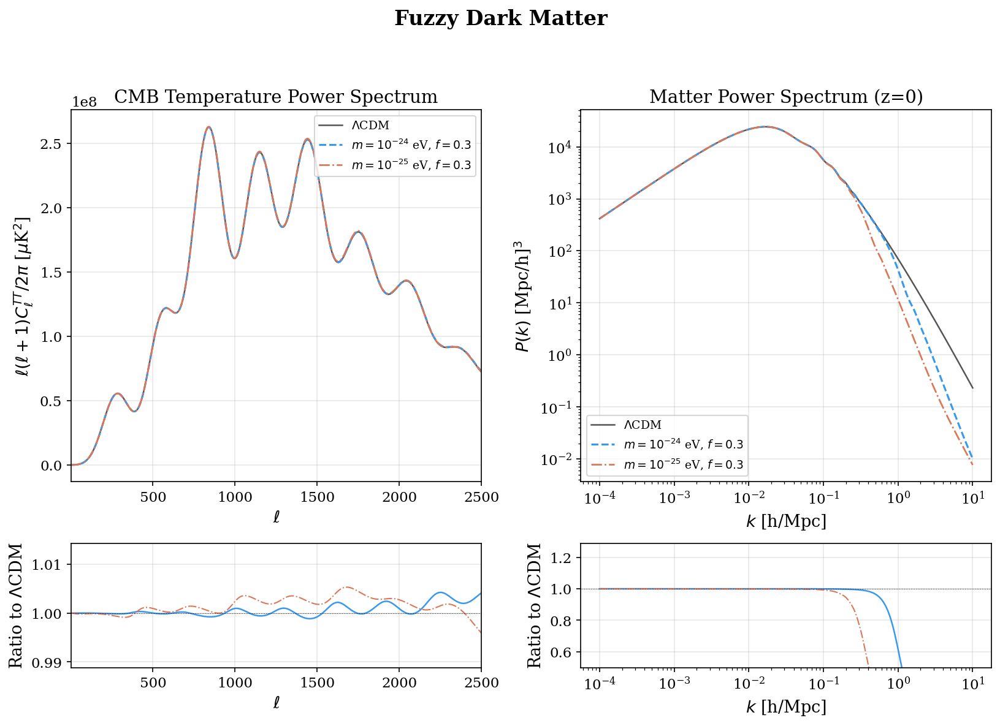
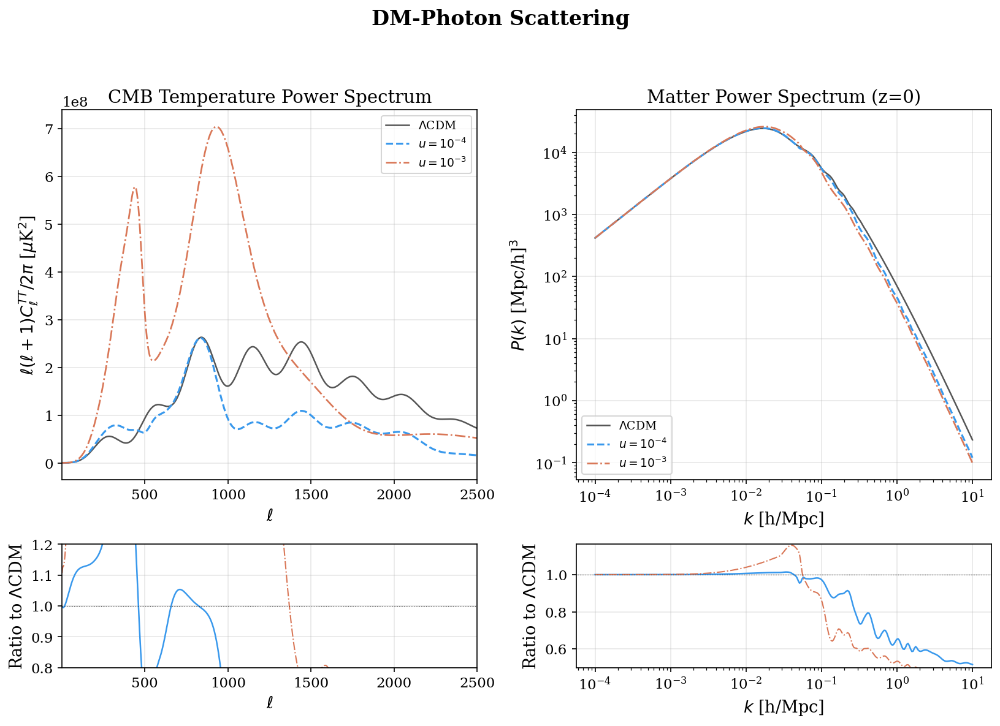
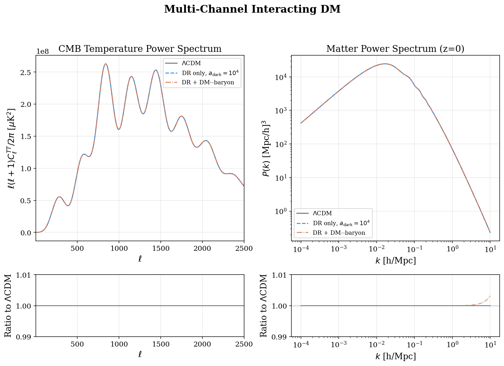
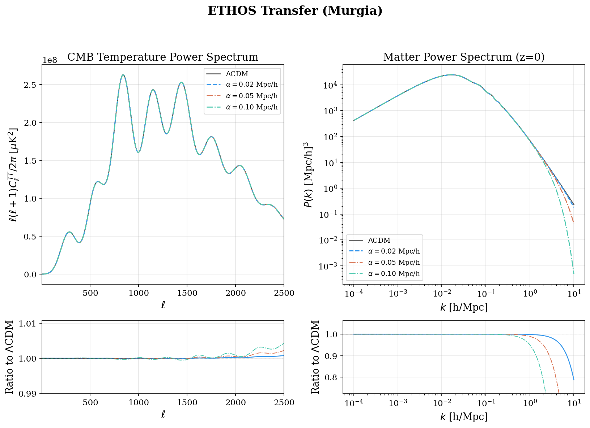
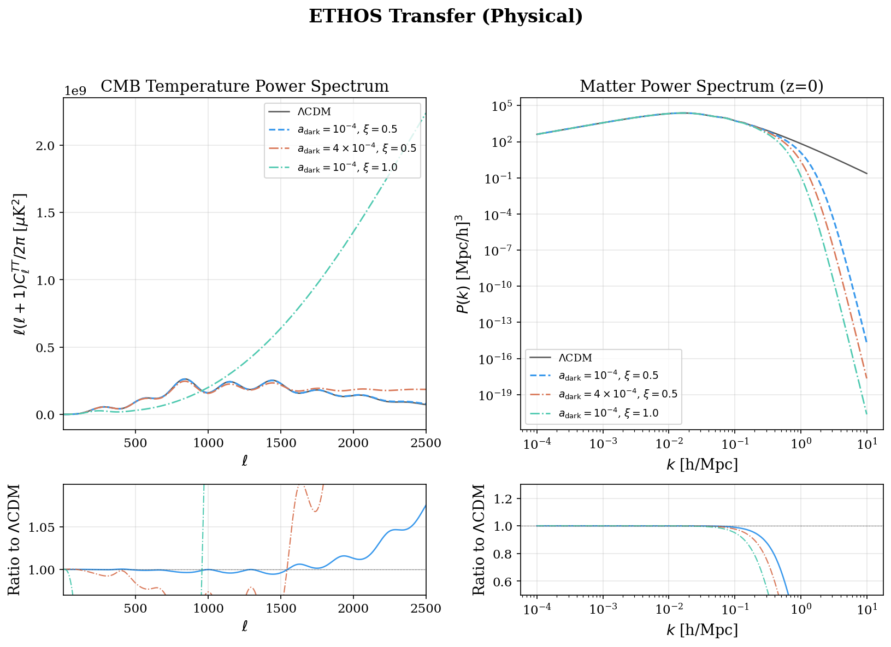

Dark Matter models
==================================

This module provides several non-standard dark-matter models on top of the
standard CAMB CDM. Each subsection below shows the comparison of CMB TT and
matter :math:`P(k)` against :math:`\Lambda`\ CDM for representative parameter
choices (left/top: spectra; right/bottom: ratio to :math:`\Lambda`\ CDM).

.. autoclass:: camb.dark_matter.DarkMatterModel
   :members:

DM--Baryon Scattering
---------------------

.. autoclass:: camb.dark_matter.DMBaryonScattering
   :show-inheritance:
   :members:

DM--Dark Radiation (ETHOS)
--------------------------

.. autoclass:: camb.dark_matter.DMDR_ETHOS
   :show-inheritance:
   :members:

Decaying Dark Matter
--------------------

.. autoclass:: camb.dark_matter.DecayingDM
   :show-inheritance:
   :members:

DM--Neutrino Scattering
-----------------------

.. autoclass:: camb.dark_matter.DMNeutrinoScattering
   :show-inheritance:
   :members:

Warm Dark Matter
----------------

.. autoclass:: camb.dark_matter.WarmDM
   :show-inheritance:
   :members:

Fuzzy Dark Matter
-----------------

.. autoclass:: camb.dark_matter.FuzzyDM
   :show-inheritance:
   :members:

DM--Photon Scattering
---------------------

.. autoclass:: camb.dark_matter.DMPhotonScattering
   :show-inheritance:
   :members:

Multi-Channel Interacting DM
----------------------------

.. autoclass:: camb.dark_matter.MultiInteractingDM
   :show-inheritance:
   :members:

ETHOS Transfer (Murgia fit)
---------------------------

Analytic surrogate for ETHOS small-scale suppression using the
Murgia et al. (2017) :math:`T(k) = [1 + (\alpha k)^\beta]^\gamma`
fitting form, applied directly to the matter power spectrum
(no CMB modification). Defaults: :math:`\beta=2.24,\ \gamma=-4.46`.

.. autoclass:: camb.dark_matter.ETHOSTransferMurgia
   :show-inheritance:
   :members:

ETHOS Transfer (Physical surrogate)
-----------------------------------

Same Murgia :math:`T(k)` form, but with the suppression scale
:math:`\alpha` derived from physical ETHOS parameters
(:math:`a_{\rm dark,n}`, :math:`\xi_{\rm DR}`, :math:`\omega_{\rm dmdr}h^2`)
through a power-law fit whose exponents are user-tunable. Intended for
fast parameter scans; for the full self-consistent ETHOS Boltzmann
solution (DAO + CMB effects) use ``DMDR_ETHOS``.

.. autoclass:: camb.dark_matter.ETHOSTransferPhysical
   :show-inheritance:
   :members:

