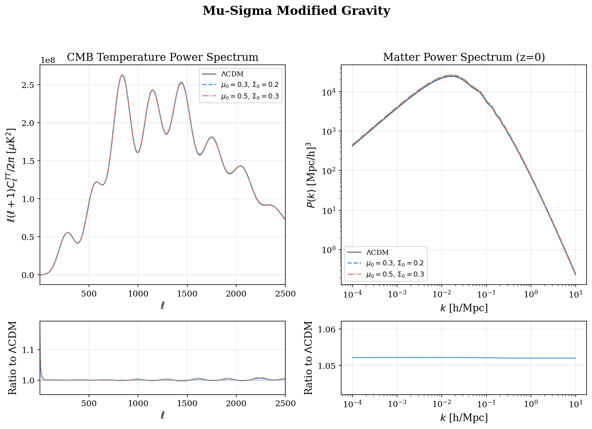

Input parameter model
==================================

.. autoclass:: camb.model.CAMBparams
   :members:
   :inherited-members:

.. autoclass:: camb.model.AccuracyParams
   :members:

.. autoclass:: camb.model.TransferParams
   :members:

.. autoclass:: camb.model.SourceTermParams
   :members:

.. autoclass:: camb.model.MuSigmaMGParams
   :members:

.. autoclass:: camb.model.CustomSources
