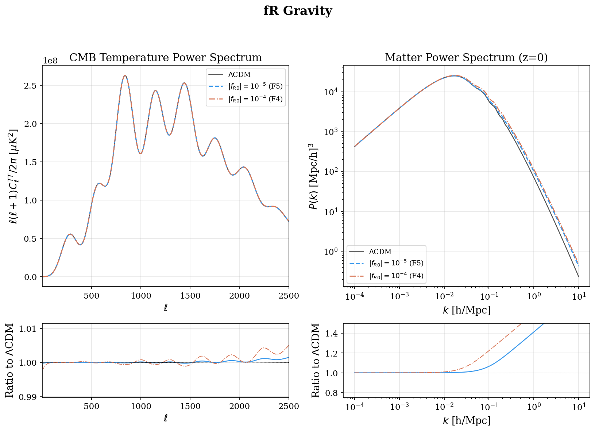
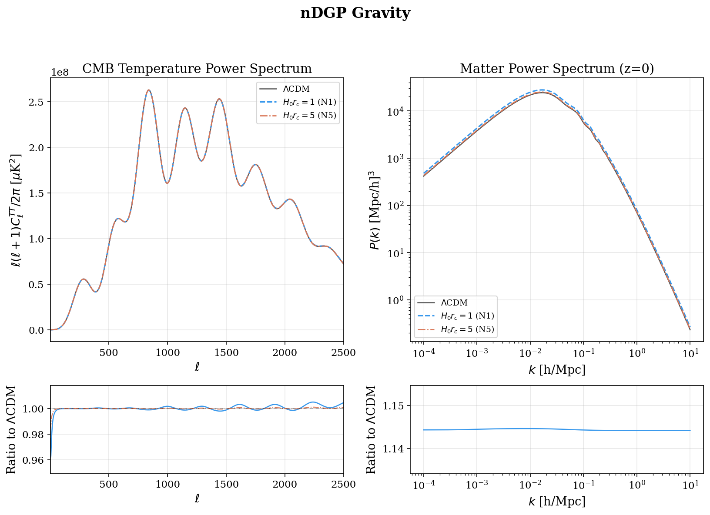
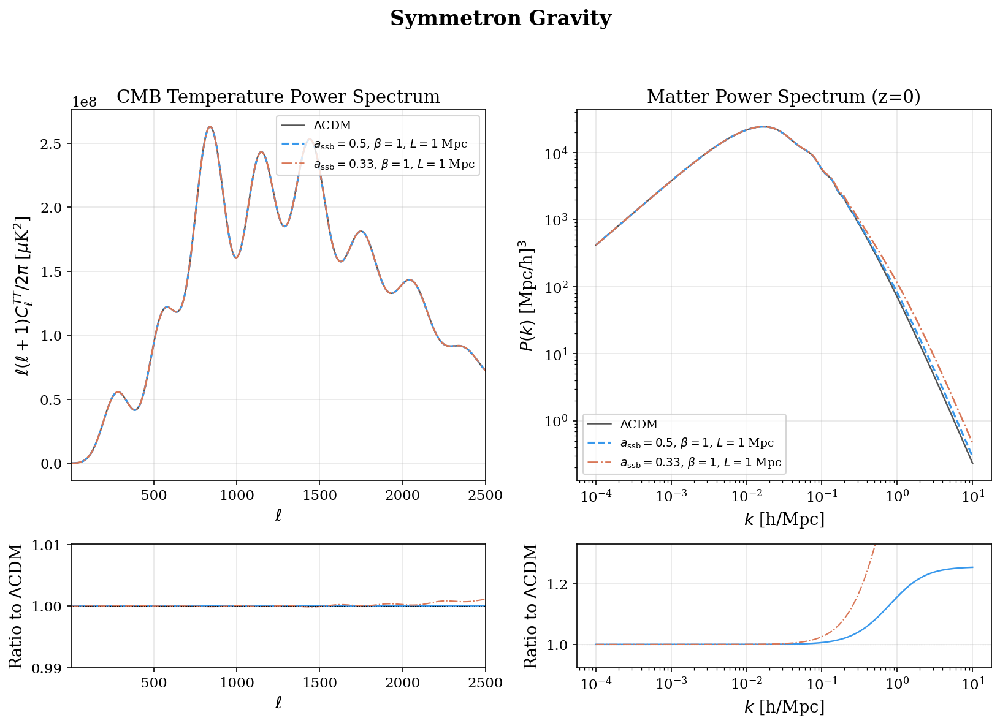

Input parameter model
==================================

.. autoclass:: camb.model.CAMBparams
   :members:
   :inherited-members:

.. autoclass:: camb.model.AccuracyParams
   :members:

.. autoclass:: camb.model.TransferParams
   :members:

.. autoclass:: camb.model.SourceTermParams
   :members:

.. autoclass:: camb.model.MuSigmaMGParams
   :members:

.. image:: figures/mu_sigma_modified_gravity.png
   :alt: mu-Sigma MG vs LCDM
   :width: 100%

Global table lifecycle
----------------------

Tabulated mu(a)/Sigma(a) functions and custom neutrino phase-space
distributions are process-global Fortran state. Named MG setters
(:meth:`.MuSigmaMGParams.set_fR`, :meth:`.MuSigmaMGParams.set_nDGP`, and
:meth:`.MuSigmaMGParams.set_symmetron`) discard stale mu/Sigma tables.
Use :meth:`.MuSigmaMGParams.clear_tables`,
:meth:`.MuSigmaMGParams.clear_MG_model`,
:meth:`.CAMBparams.clear_ncdm_psd`, or :func:`camb.free_global_memory` at
independent-run boundaries. The last option also releases thermal-neutrino
interpolation and perturbation caches.

f(R) Gravity (Hu--Sawicki)
--------------------------

Linear quasi-static f(R) via :meth:`.MuSigmaMGParams.set_fR`:
mu(a,k) = (1+4Q/3)/(1+Q) with Q = k^2/(a^2 M^2(a)), Sigma = 1, on an exact
LCDM background. Linear theory only (no chameleon screening).

nDGP Gravity (Normal Branch)
----------------------------

Scale-independent growth enhancement via :meth:`.MuSigmaMGParams.set_nDGP`:
mu(a) = 1 + 1/(3 beta(a)), Sigma = 1. Linear theory only (no Vainshtein
screening).

Symmetron Gravity
-----------------

Symmetry-breaking fifth force via :meth:`.MuSigmaMGParams.set_symmetron`:
GR before a_ssb, then mu(a,k) = 1 + 2 beta(a)^2 k^2/(k^2 + a^2 m(a)^2),
Sigma = 1. Linear theory only.

.. autoclass:: camb.model.CustomSources
